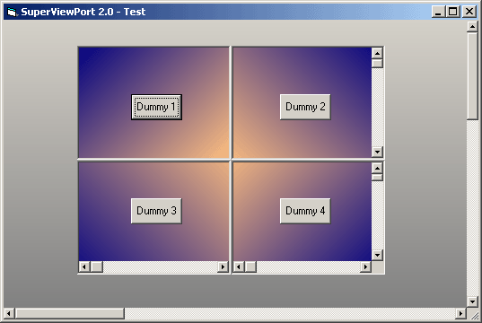

<div align="center">

## SuperViewPort 2\.0


</div>

### Description

This is very advanced type of container control based on virtual viewport.

You are able to put other controls on it but also outside of visible area, enable scrollbars (created at runtime) and use them to navigate viewport.

It has a very fast angle-defined two-color gradient feateure.

Includes mouse tracking, so you can (optionaly) drag the content of the control by holding LMB.

This code teaches you a lot of window API

for ex: using windows api's on usercontrol, dynamic scrollbar creation and manipulation, drawing on usercontrols.

Vote if you find it usefull/educative.
 
### More Info
 


<span>             |<span>
---                |---
**Submitted On**   |2002-10-29 22:26:18
**By**             |[ORSHEE](https://github.com/Planet-Source-Code/PSCIndex/blob/master/ByAuthor/orshee.md)
**Level**          |Advanced
**User Rating**    |4.9 (34 globes from 7 users)
**Compatibility**  |VB 6\.0
**Category**       |[Custom Controls/ Forms/  Menus](https://github.com/Planet-Source-Code/PSCIndex/blob/master/ByCategory/custom-controls-forms-menus__1-4.md)
**World**          |[Visual Basic](https://github.com/Planet-Source-Code/PSCIndex/blob/master/ByWorld/visual-basic.md)
**Archive File**   |[SuperViewP14906211120\.zip](https://github.com/Planet-Source-Code/orshee-superviewport-2-0__1-40230/archive/master.zip)

### API Declarations

```
lots of :)))
check the code
(this example teaches you using them)
```


